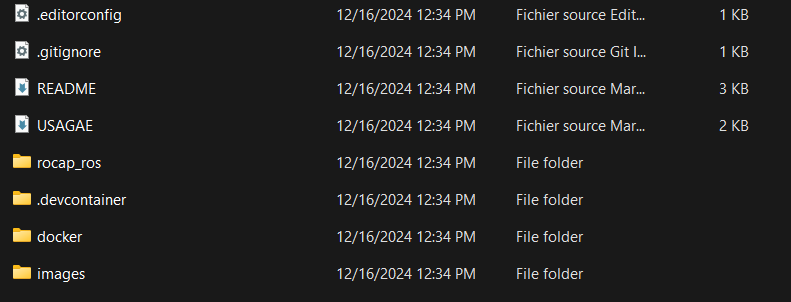
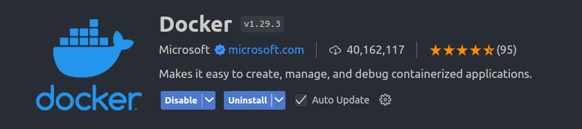
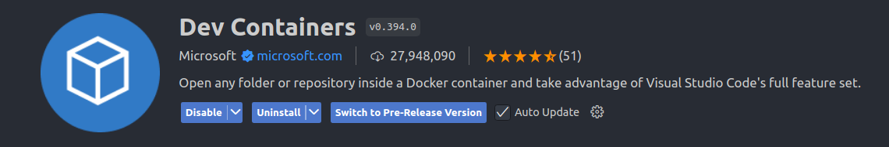
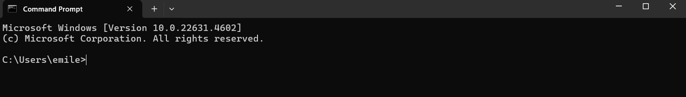
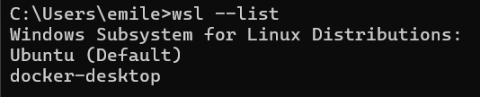
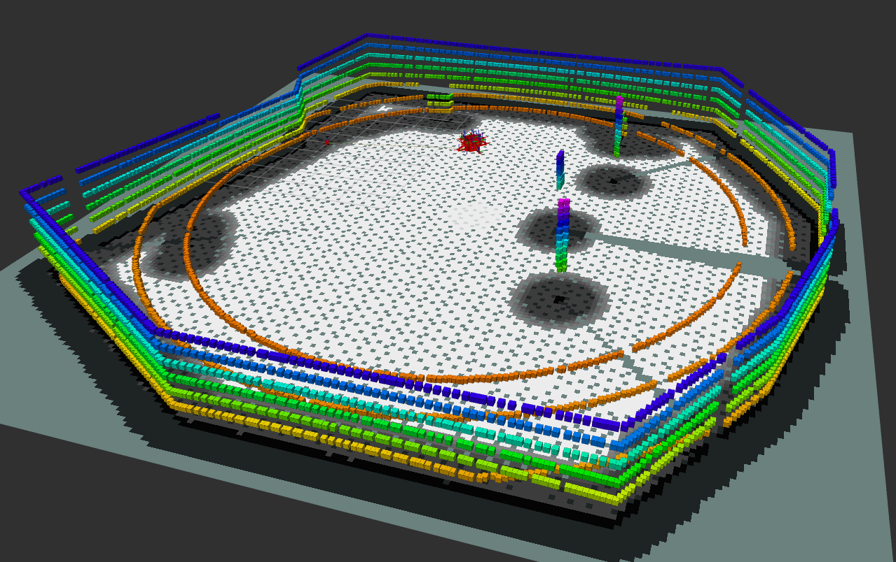

# Table of contents

- [Table of Content](#table-of-content)
- [Introduction](#introduction)
- [Install Docker](#install-docker)
  - [Recommendations](#recommendations)

# Initial Setup

## Docker Installation
This repository is built with [Docker](https://docs.docker.com/?_gl=1*jirhkt*_gcl_aw*R0NMLjE3Mjk3MTE0OTEuRUFJYUlRb2JDaE1JMVB1ZHRwMmxpUU1WRFU3X0FSMDFfZzVPRUFBWUFTQUFFZ0tsOFBEX0J3RQ..*_gcl_au*MjEwMDM5OTQxNS4xNzI3MTExOTkz*_ga*MzI1MTgxNzg4LjE3MjcxMTA2OTA.*_ga_XJWPQMJYHQ*MTczNDAyOTUzOS4yMy4xLjE3MzQwMjk3ODUuNDcuMC4w). This allows the code to run on a Ubuntu 22.04 image with ROS2 Humble LTS and all necessary dependencies regardless of the user's operating system. 

For Docker installation instructions, follow the following link:
- [Docker Windows](https://docs.docker.com/desktop/setup/install/windows-install/)


## Setup Repository in Visual Studio Code
Once Docker installed, make sure the Docker Desktop application remains open for the remainder of the process. You may now open the source code in the VSCode IDE. When selecting the folder, make sure to select the folder where the .devcontainer folder is visible as illustraded in the image bellow. this will allow VSCode to repoen the workspace in a DevContainer



Once opened in VScode, make sure you have the following extensions installed:




Your VSCode environment is now ready.

## Setup WSL

To access UI applications from a Dev Container from Windows, certain steps must be followed.

Begin installing the Ubuntu application byt following the link: [Ubuntu installation](https://apps.microsoft.com/detail/9pdxgncfsczv?hl=en-US&gl=US)

This will essentially allow to run a WLS terminal from Windows.Then, open a Command Prompt by typing:

```bash
Windows Key + "cmd:
```

The following window should open:



Run the following line in the Command Prompt to verify that Ubuntu is correctly installed
```bash
wsl --list
```
The command should result in the following:



If Ubuntu is not listed as default, run the following
```bash
wsl --set-default ubuntu
wsl --shutdown
```
TODO: ADD INFO FOR UBUNTU NOT IN LIST

This will open up a wsl terminal from windows. From there, navigate to the docker directory of the Rocap repository. If you run the following command:
```bash
ls
```
You should get this result

```bash
build.bash
docker-compose.override.wsl.yml
docker-compose.override.linux.yml
docker-compose.yml
docker-compose.override.windows.yml
Dockerfile
```

You can then run the following command to run the dedicated docker compose:

```bash
docker-compose -f docker-compose.yml -f docker-compose.override.wsl.yml up
```

You can then open then open the workspace folder in VSCode and reopen the workspace in a dev container. Once built, execute the following command in a VSCode terminal
```bash
./build.bash
```
This will clone the repository and install all necessary dependecies

# Usage
Once in a working container, the code is now ready to be used.

## Using the Rocap in simulation
To launch the Rocap in a Gazebo simulation run the following command in container terminal:

```bash
ros2 launch rocap_ros rocap.launch.py
```
This will launch all necessary nodes to operate the Rocap in its simulation environment. The process should yield the following result after a couple of seconds (up to 30s):



If it does not, please refer to the [Know Issues](#known-issues) tab for more information.


## Using the real Rocap
Before using the real Rocap, ensure you have completed the following steps:
1. Request a signed_permissions.json file from the Rocap administrator.
2. Place the signed_permissions.json file in the permissions folder.
3. Determine the IP address and communication port of the Rocap you want to control.

Once you have completed the above steps, you can start the API bridge to control the Rocap through ROS using the following command:

```bash
ros2 launch rocap_ros rocap_bridge base_url:='http://<rocapIP>:<rocapPort>'
```

# Contact
This code was written by the Cégep Édouard-Montpetit under grant 22CTA034

