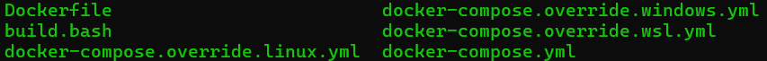
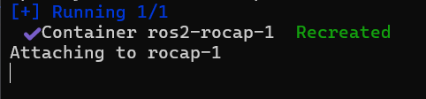
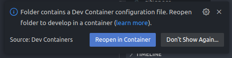
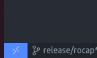
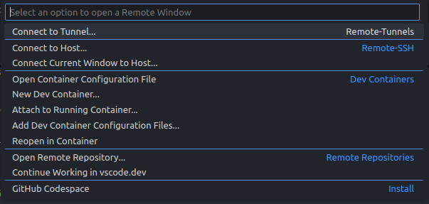

# Table of contents

- [Table of Content](#table-of-content)
- [Introduction](#introduction)
- [Install Docker](#install-docker)
  - [Recommendations](#recommendations)

# Initial Setup

## Docker Installation
This repository is built with [Docker](https://docs.docker.com/?_gl=1*jirhkt*_gcl_aw*R0NMLjE3Mjk3MTE0OTEuRUFJYUlRb2JDaE1JMVB1ZHRwMmxpUU1WRFU3X0FSMDFfZzVPRUFBWUFTQUFFZ0tsOFBEX0J3RQ..*_gcl_au*MjEwMDM5OTQxNS4xNzI3MTExOTkz*_ga*MzI1MTgxNzg4LjE3MjcxMTA2OTA.*_ga_XJWPQMJYHQ*MTczNDAyOTUzOS4yMy4xLjE3MzQwMjk3ODUuNDcuMC4w). This allows the code to run on a Ubuntu 22.04 image with ROS2 Humble LTS and all necessary dependencies regardless of the user's operating system. 

For Docker installation instructions, follow the following link:
- [Docker Windows](https://docs.docker.com/desktop/setup/install/windows-install/)

Once Docker is installed, make sure the Docker Desktop application remains open for the remainder of the process. 

## Setup WSL

To access UI applications from a Dev Container from Windows, certain steps must be followed.

Begin by installing the Ubuntu application by following the link: [Ubuntu installation](https://apps.microsoft.com/detail/9pdxgncfsczv?hl=en-US&gl=US)

This will essentially allow to run a WLS terminal from Windows. Then, open a Command Prompt by typing:

```bash
Windows Key + "cmd:
```

The following window should open:


Run the following line in the Command Prompt to verify that Ubuntu is correctly installed
```bash
wsl --list
```
The command should result in the following:


If Ubuntu is not listed as default, run the following
```bash
wsl --set-default Ubuntu
wsl --shutdown
```
TODO: ADD INFO FOR UBUNTU NOT IN LIST

You can then open a Ubuntu temrinal by simply running the following command in your Command Prompt

```bash
bash
```

Once this is done, and you have entered the correct terminal, please navigate to the "docker" folder of the provided repository. If you run the following command:

```bash
ls
```
You should get this result



You can then run the following command to run the dedicated docker compose:

```bash
docker-compose -f docker-compose.yml -f docker-compose.override.wsl.yml up
```

Once the process is done, you will get the following output:



## Setup Repository in Visual Studio Code
You may now open the source code in the VSCode IDE. When selecting the folder, make sure to select the folder where the .devcontainer folder is visible as illustraded in the image bellow. this will allow VSCode to repoen the workspace in a DevContainer


Once opened in VScode, make sure you have the following extensions installed:


Once these installed, you should be able to reopen the workspace into a Dev Container. This can be done 2 ways.

1. Use the provided VSCode popup upon opening of the workspace



2. Open manually
  - Click on this button on the bottom left of VSCode

  

  - Select the "Reopen in Container option

  

  The process might take a few minutes on the first build. Once finnished, you should be within a Dev Container with only a file named build.bash. You can then open a new terminal directly from VSCode where you can run the following command to execute the building process:

```bash
./build.bash
```
This will clone the repository and install all necessary dependecies to the workspace. You are now ready to use the Rocap

# Usage
The ROS2 environment for the Rocap has been built to simulate an array of situations. Both using the real Rocap and using the simulation. For information about controlling the Rocap's position, please refer to the [Rocap Control](#known-issues) tab.

The rocap uses a single master launch file that can be manipulated by the user dependant on the situation desired. Here are the different configurations:

This will launch the Rocap in a complete simulation environment. Boths its odometry and lidar data will be generated by the simulation.
```bash
ros2 launch rocap_ros rocap.launch.py
```
This will launch the API bridge and the necessary drivers for the lidar integration.
```bash
ros2 launch rocap_ros rocap.launch.py sim:=false velodyne:=true
```
*Other configurations are possible but have not been tested.


If you encounter any issues, refer to the [Know Issues](#known-issues) tab for more information.

# Contact
This code was written by the Cégep Édouard-Montpetit under grant 22CTA034

